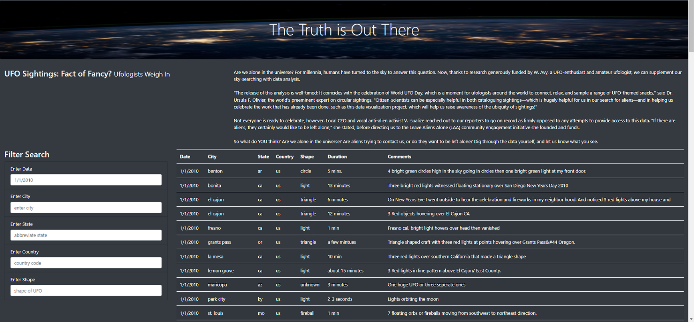
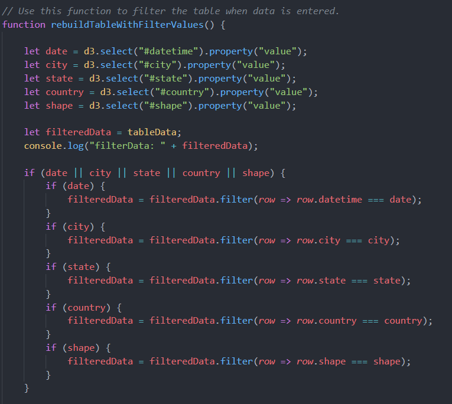
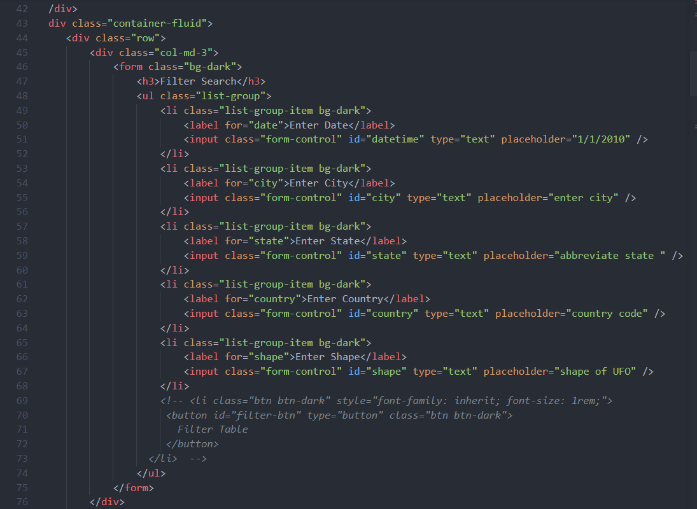
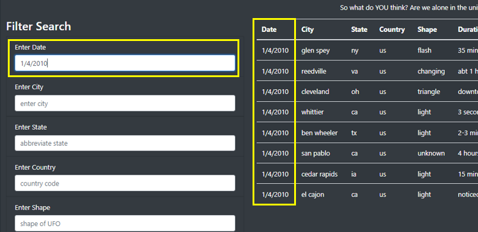
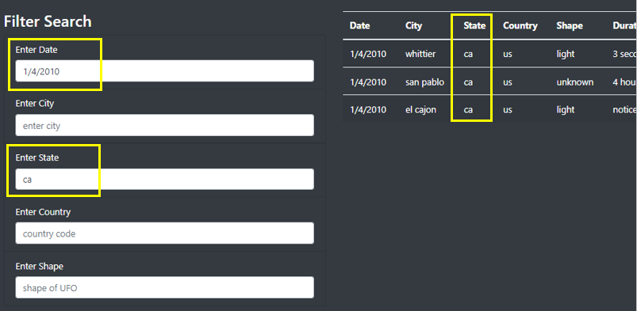
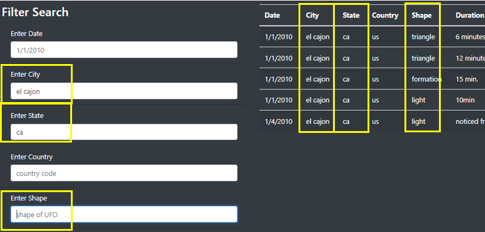
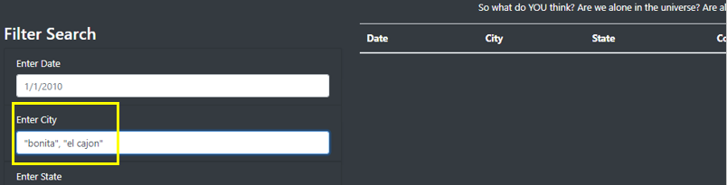

# UFOs - Deployed at https://kjkubik.github.io/UFOs/ (Check it out!)
Javascript, HTML, CSS, Bootstrap, ETL, displaying tabled data using Javascript D3 library

## Project Overview:
In this project a dynamic/interactive web page using JavaScript is created. JavaScript (D3) is used to load an array of table rows into the HTML web page table. Multiple filters are also created so that the table data can be filtered by users of the web page. CSS and Bootstrap are used to style the web page. 

At first, I use Chrome Development Tools to debug JavaScript; however, I find it much more efficient to download Node.js and debug my app from Visual Studio. 

## Current Status and Recommendations for Webpage: 

During my career as a developer, I have found written communication as an extremely effective way of organizing thoughts before verbally communicating them. Here is an example of what I would be sure to communicate to my teammate, Dana. 

Hey Dana,

First, I want to thank you for taking the time to plan and create the initial UFO web page. The format of it is wonderful. I love the picture you found for the header. 

To continue, I was able to add city, state, country and shape filters so that the user wouldn't be limited to a single filter. 

Here is the current web page: 

Here is the main block of code I added to in apps.js: 

Here is the HTML form additions I made:

### Single Filter Criteria
The user can still filter table on a single row. Say date is entered, the resulting filtered rows would be:

### Multiple Line Criteria
It is also possible to enter a single value into multiple fields. Example shown:

### Eliminating Criteria
The user will not have to start all over when needing to eliminate criteria. They can simply remove a criteria  and press [ENTER]. For example, say the user wanted to remove "shape" from the above criteria, the following results would be presented.

NOTE: Presently, the user doesn't have any way to enter multiple criteria in one field. There will be no resulting rows in the table (below)

### Removing All Criteria
The user is able to start over by either refreshing the page (pressing F5) or delete criteria from fields and pressing Enter.

### Future Planning
Again, this is a great start on for our UFO webpage. For this page to be well received by our users, we may want to do the following revisions. (Remember, presentation is everything.)

- Create data transformation program editing the data presented. 
    - Capitalize cities, state abbreviations and country codes.
    - Change the date to be in MM/DD/CCYY format.
    - Standardize duration: 
      - If duration is “15:00 mins”, change it to “15 min”.
      - If duration is “1-2 mins”, change to “2 min”.
      - If duration is not numeric (i.e. “dusk to dawn”), change to “unknown”.
    - Some of the comments are cryptic. For example, “Orange spheres in sky New Year&#39s Eve&#44 San Diego&#44 CA”. 
    - Some of the comments are ridiculous. Read through them and get with me on a solution. I believe we should agree on a solution before transforming the comments field.
- Shorten the entry fields; they take up way too much space on the page.  
- Incorporate drop-down lists for state and country. This will alleviate the pain of having to type in everything. Only give values present in the data.
- Is there any way to reposition the filters so they take the place of the actual column headings of the table? This would save more room on the page. If we save enough room and this site is made public, we might want to think about space for UFO related ads.
- I love the filtering idea, over all. Another thing we might want to incorporate in the web page are clear, sort or download results buttons to make it even more interactive.
- Incorporate a filter for the duration and comments fields. The comments field filter should be a filter that the user can search for key words.

Please let me know if you have any questions, concerns or suggestions.

Thanks,
Kim Kubik